# Architecture and Lifecycle Diagrams

Status: Explanatory; normative rules live in the referenced design documents  
Date: 2026-08-25

## 1. Distribution trust and runtime authority are separate

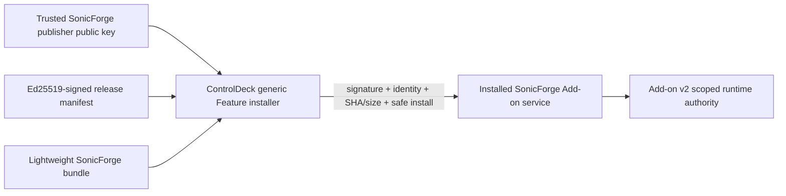

A valid publisher signature authorizes a release from a trusted publisher; it does not bypass Add-on capability grants or Runtime API authorization.

## 2. System ownership

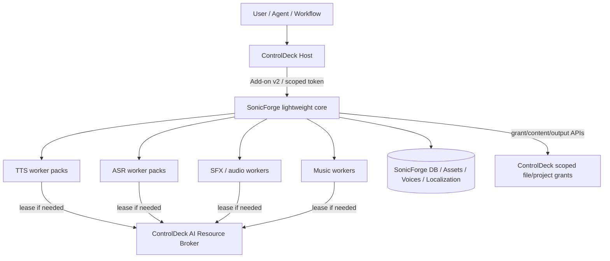

ControlDeck owns generic host/trust/resource/file boundaries; SonicForge owns audio-specific behavior and heavy environments.

## 3. Repository/environment boundary

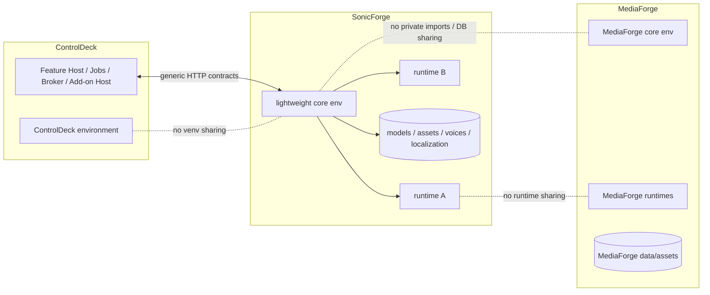

## 4. Fresh install + Speech Essentials

```mermaid
sequenceDiagram
    participant User
    participant CD as ControlDeck Feature Host
    participant Rel as Signed Release Assets
    participant SF as SonicForge core
    participant Job as ControlDeck Job
    participant Setup as SonicForge setup orchestrator
    participant Worker as TTS/ASR smoke tests

    User->>CD: Install/Update SonicForge
    CD->>Rel: Fetch manifest + signature + bundle
    CD->>CD: Verify publisher signature, identity, downgrade, size, SHA, archive
    CD->>CD: Stage/provision/health, atomic activate
    User->>CD: Open Audio
    CD->>SF: Proxied embedded view
    SF-->>User: Speech Essentials setup required
    User->>SF: 音声基本環境をセットアップ / Set up Speech Essentials
    SF->>Setup: Build read-only preflight plan
    Setup-->>User: disk/hardware/download/license plan
    User->>SF: Confirm required terms
    SF->>Job: Create/attach durable setup job
    SF->>Setup: Apply speech-essentials
    Setup->>Setup: Download/build into staging
    Setup->>Worker: Japanese + English TTS/ASR smoke tests
    Worker-->>Setup: Pass/fail by capability/language
    alt pass
      Setup->>Setup: Atomic activate
      Setup->>Job: succeeded
      SF-->>User: Speech available; optional Game Audio/Music can be added later
    else partial or fail
      Setup->>Setup: Keep last known-good runtime
      Setup->>Job: failed/degraded with actionable reason
      SF-->>User: Retry/repair or available fallback
    end
```

The signed ControlDeck feature installer handles the lightweight product. SonicForge handles its ML capability packs. Neither path executes arbitrary Add-on-supplied shell from the manifest.

## 5. Optional capability install

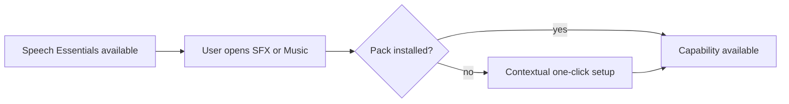

Not installing optional Game Audio/Music does not degrade a healthy speech service.

## 6. GPU-backed generation

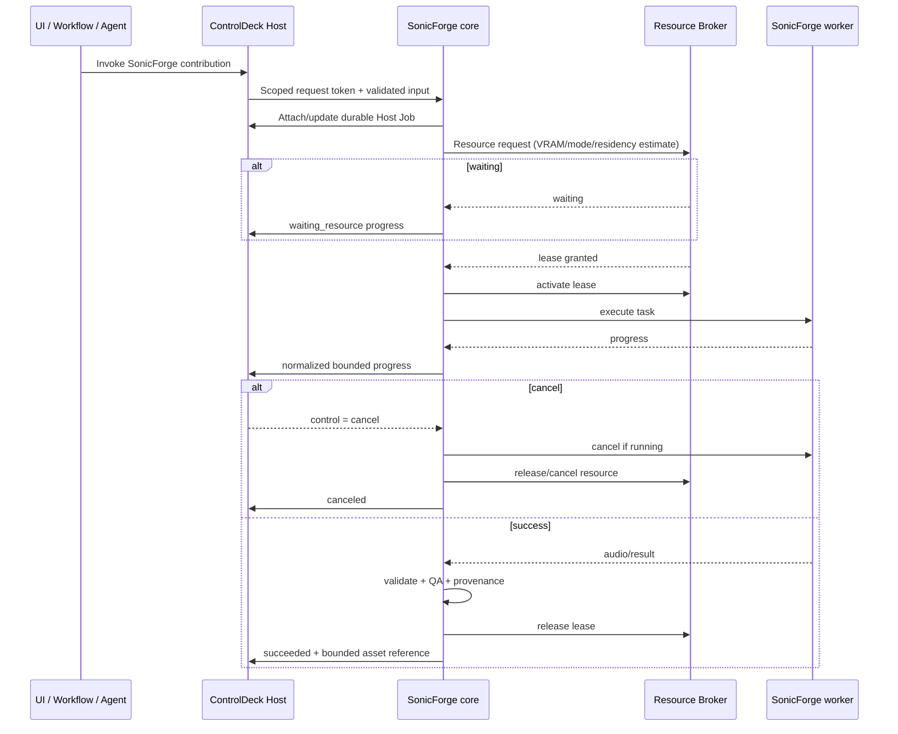

Queued work that has not started can settle cancellation immediately; running work is unwound by the owner.

## 7. Host file input/output

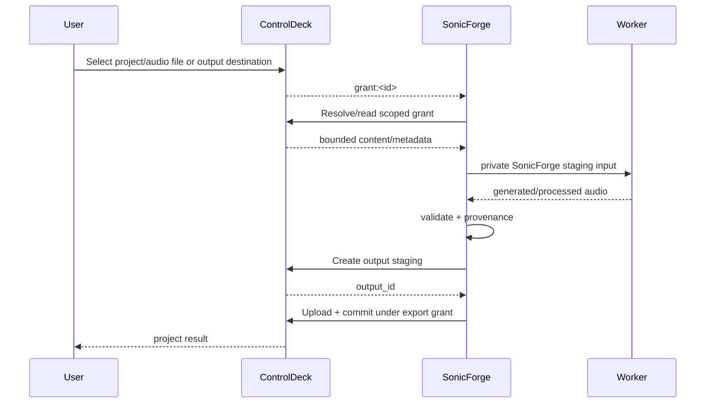

SonicForge never needs the absolute ControlDeck project path.

## 8. Language-aware capability routing

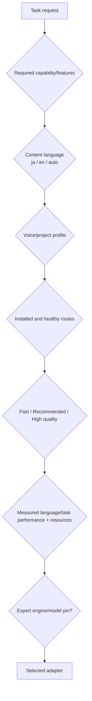

Japanese and English can use different ASR routes. The public contract does not force one model to cover all languages.

## 9. Capability health after Speech Essentials

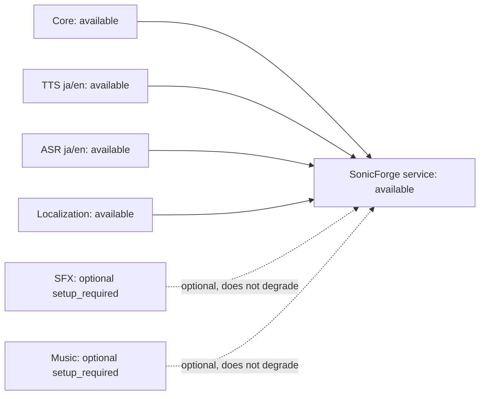

A missing optional pack is not a service failure.

## 10. Durable browser reconnection

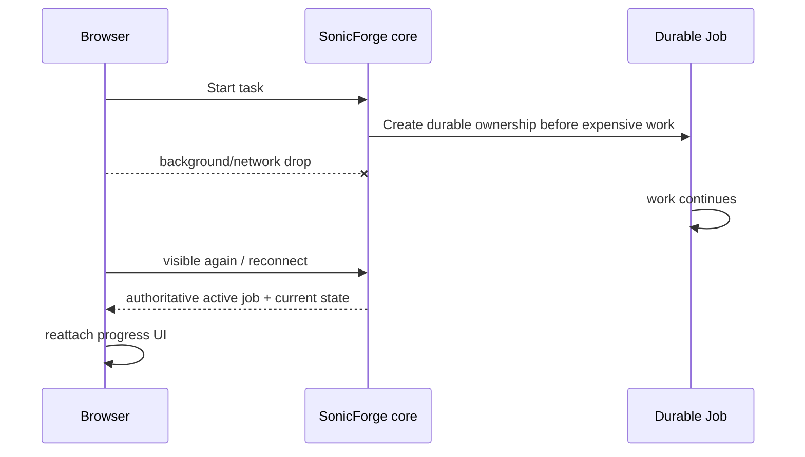

Do not cache a dead socket forever or depend on browser memory for job ownership.

## 11. Localization Studio

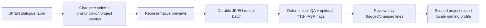

TTS->ASR QA is a mismatch flagging heuristic, not proof of naturalness or emotion.

## 12. ControlDeck TTS migration

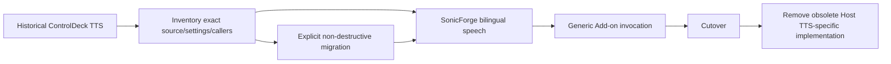

Do not delete historical data or invent a compatibility shim before locating the historical source.

## 13. MediaForge + SonicForge composition

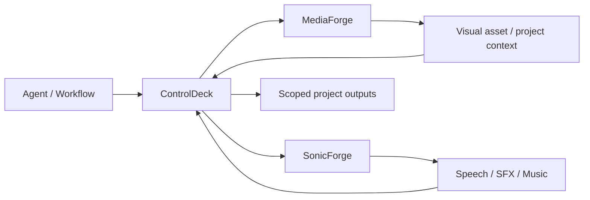

Composition uses generic ControlDeck contracts and logical grants/assets, not shared private code/directories.

## 14. Document pointers

- ownership/boundaries: `01-boundaries-and-contracts.md`
- setup/runtime: `02-runtime-environment-and-setup.md`
- API/languages: `03-audio-capabilities-and-api.md`
- engines/models: `04-engine-model-strategy.md`
- UX/localization/reconnect: `05-ux-and-workflows.md`
- security/license/provenance: `06-security-license-and-provenance.md`
- TTS migration: `07-controldeck-tts-migration.md`
- quality gates: `08-development-process-and-quality-gates.md`
- roadmap: `09-roadmap.md`
- decisions: `11-decisions-and-open-questions.md`
- release signing: `13-release-distribution-and-signing.md`
- critical UX review: `14-bilingual-ux-and-critical-review.md`
