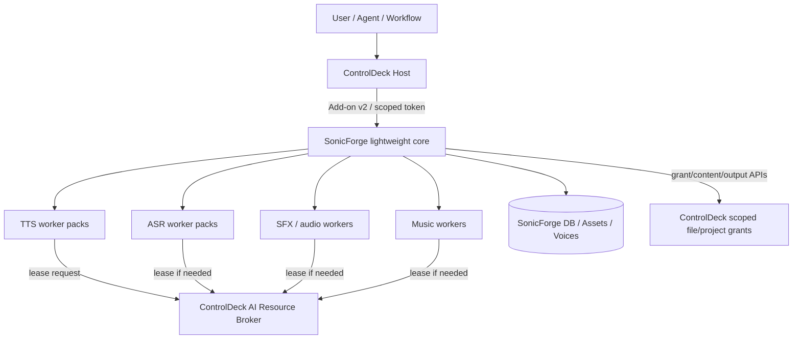
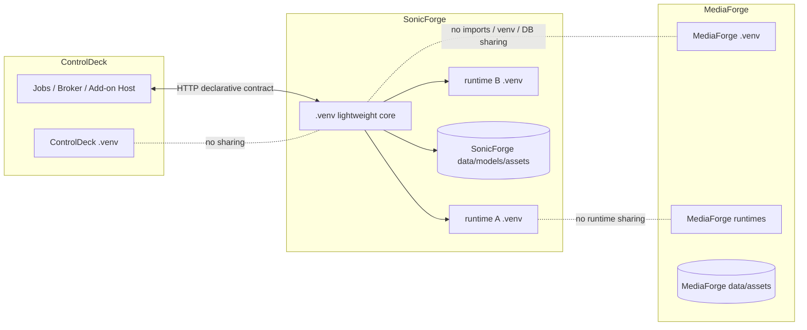
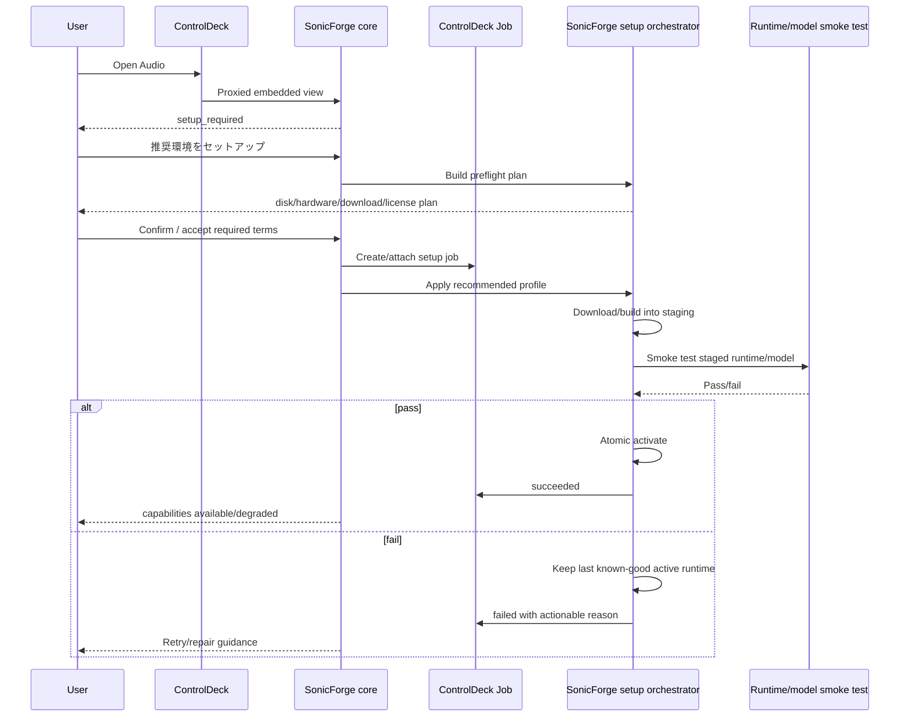
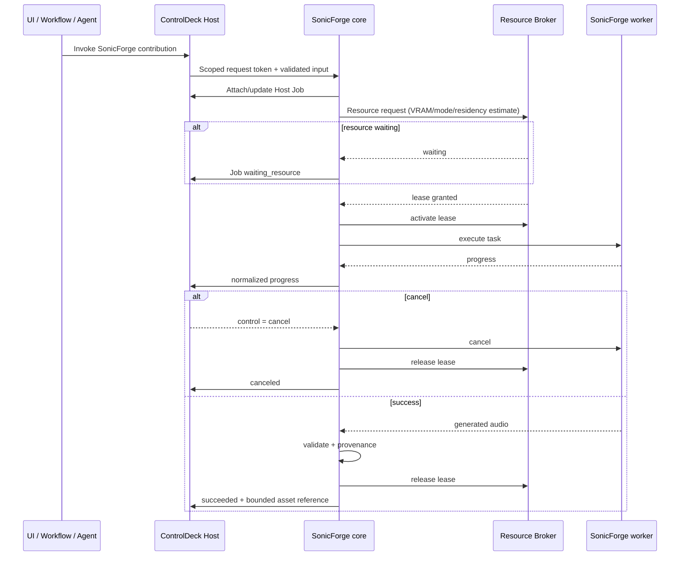
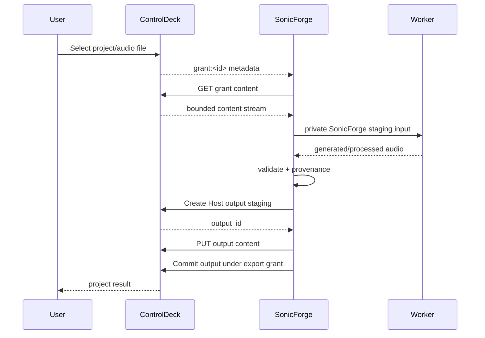
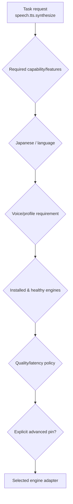
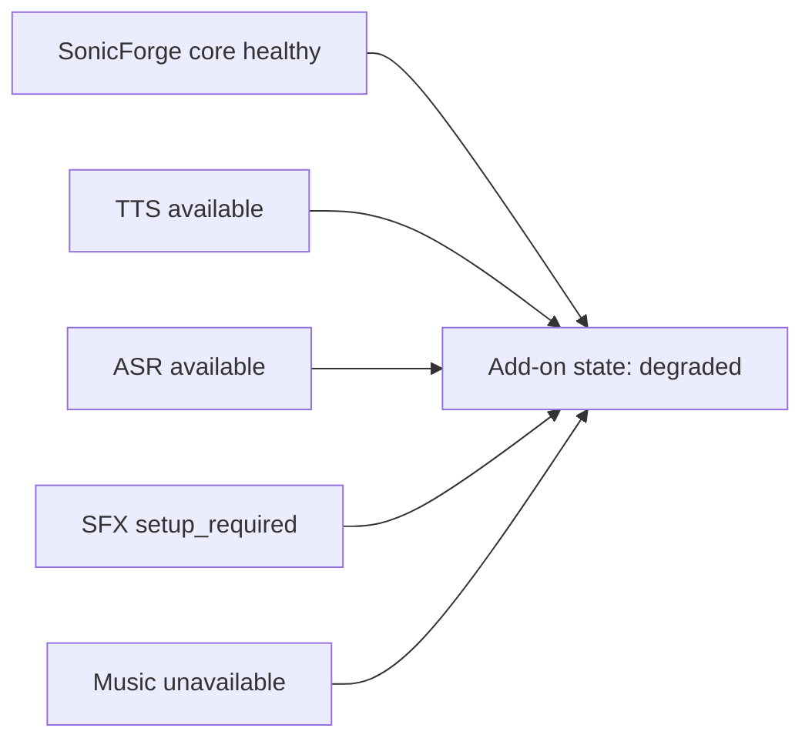
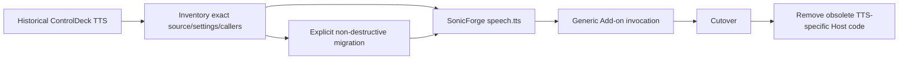
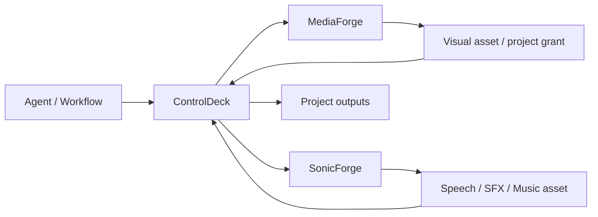

# Architecture and Lifecycle Diagrams

Status: Explanatory; normative rules live in the referenced design documents  
Date: 2026-08-25

## 1. System ownership

Key rule: ControlDeck hosts generic platform capabilities; SonicForge owns all audio-specific behavior and heavy environments.

## 2. Repository/environment boundary

## 3. First-use setup

The button runs SonicForge's own setup API. ControlDeck does not execute an arbitrary command supplied by the Add-on manifest.

## 4. GPU-backed generation

Waiting for a GPU must not be implemented as a hidden busy loop that bypasses the Host broker.

## 5. Host file input/output

At no point does SonicForge need the absolute ControlDeck project path.

## 6. Capability routing

Model names are routing details. Stable callers should not need to know them.

## 7. Capability degradation

An optional music worker failure must not make Japanese transcription disappear.

## 8. ControlDeck TTS migration

Do not delete historical data or invent a compatibility shim before the historical source is located.

## 9. MediaForge + SonicForge composition

Composition happens through ControlDeck contracts and logical assets/grants, not a shared directory shortcut or Python import.

## 10. Document pointers

- ownership/boundaries: `01-boundaries-and-contracts.md`
- setup/runtime lifecycle: `02-runtime-environment-and-setup.md`
- API/capabilities: `03-audio-capabilities-and-api.md`
- engines/models: `04-engine-model-strategy.md`
- UX: `05-ux-and-workflows.md`
- security/license/provenance: `06-security-license-and-provenance.md`
- TTS migration: `07-controldeck-tts-migration.md`
- development gates: `08-development-process-and-quality-gates.md`
- implementation order: `09-roadmap.md`
